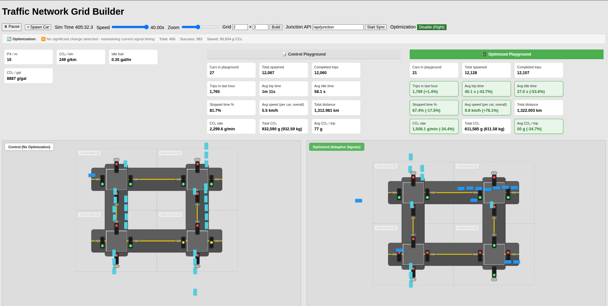

# Traffic Simulation (Web-Based)

A web-based traffic simulation built with **HTML**, **CSS**, and **JavaScript (ES Modules)**.  
It models a **grid of junctions** connected by roads, where **vehicles spawn**, **navigate routes**, **obey traffic signals**, and **avoid collisions**. The simulation also tracks real-time metrics such as **vehicle counts**, **trip times**, **CO₂ emissions**, and **throughput** for performance comparison and optimization experiments.

---

## Features

- **Grid-based road network**
  - Configurable rows/columns (junction grid)
  - Roads automatically connect junctions

- **Vehicle simulation**
  - Vehicles spawn over time and travel through the grid
  - Route navigation across junctions
  - Collision avoidance / basic queuing behavior

- **Traffic signals**
  - Junction-level signal cycles
  - Vehicles respect red/yellow/green phases

- **Live statistics (real-time)**
  - Vehicle counts (active / completed)
  - Average trip time (per vehicle)
  - CO₂ emissions (per vehicle and/or total)
  - Throughput (vehicles completed per unit time)

- **Interactive UI**
  - Start / pause / reset controls
  - Speed control (if enabled)
  - View navigation (pan/zoom if supported in your UI)
  
## Key Components

### Frontend
- **`index.html`**
  - Main page layout: controls (play/pause, speed, zoom, grid size), stats display, and simulation canvas/container.
- **`style.css`**
  - UI styling for grid cells, roads, junctions, traffic lights, vehicles, and stats cards.

### Core Simulation
- **`js/app.js`**
  - Entry point + core app logic:
    - Initializes the world and UI
    - Main simulation loop (tick/update/render)
    - UI event handlers (play/pause, speed, zoom, grid rebuild)
    - Stats rendering into the `.stats` container
- **`js/world.js`**
  - World state manager:
    - Junction/road network construction
    - Vehicle lifecycle (spawn → travel → complete)
    - Queuing / collision avoidance logic
    - Telemetry tracking (distance traveled, idle time, CO₂, etc.)
- **`js/vehicle.js`**
  - Vehicle behavior:
    - Waypoint navigation and movement planning
    - Traffic signal obedience (stop/go logic)
    - Progress tracking (trip time, distance, waiting/idle time)

### Junctions & Signals
- **`js/junction.js`**
  - Junction visuals and mechanics:
    - Stop lines
    - Traffic light placement
    - Exit toggles / junction-level controls (if enabled)
- **`js/signal.js`**
  - Signal phase controller:
    - EW/NS green/yellow/red transitions
    - Optional all-red buffers (if configured)

### Routing & Geometry
- **`js/router.js`**
  - BFS-based pathfinding between junctions to generate vehicle routes.
- **`js/geometry.js`**
  - Grid math utilities:
    - Cell positions and centers
    - Junction bounding boxes
    - Coordinate conversions used by rendering

### Configuration & Utilities
- **`js/config.js`**
  - Immutable constants such as:
    - Vehicle sizes/speeds
    - Signal timings (green/yellow/all-red durations)
    - Grid/cell sizes
    - Spawn rules / limits (if used)
- **`js/ui.js`**
  - Viewport interactions:
    - Zooming
    - Panning/dragging
    - Centering after rebuild
- **`js/utils.js`**
  - Shared helpers:
    - `clamp`, `nowMs`, key generation, direction helpers, etc.

- to run the server
- python -m http.server 5500
- or
- python3 -m http.server 5500

- to access
- localhost:5500